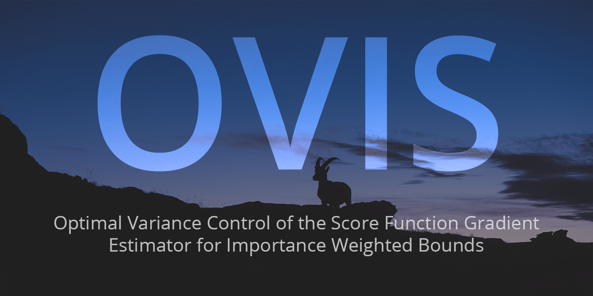
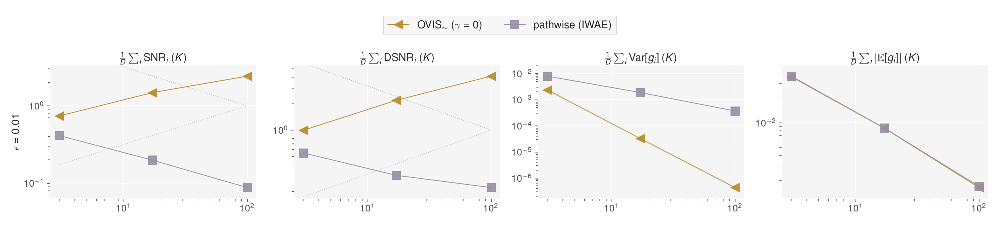
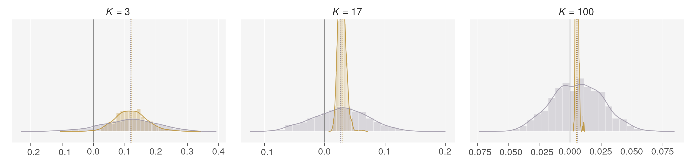
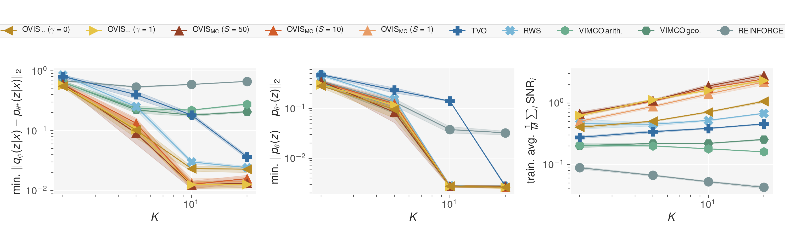
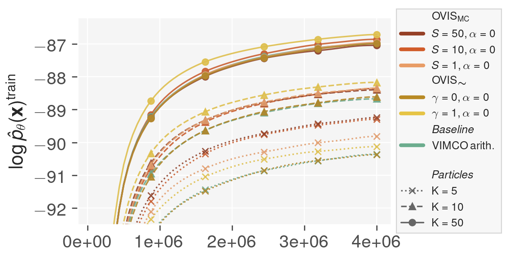
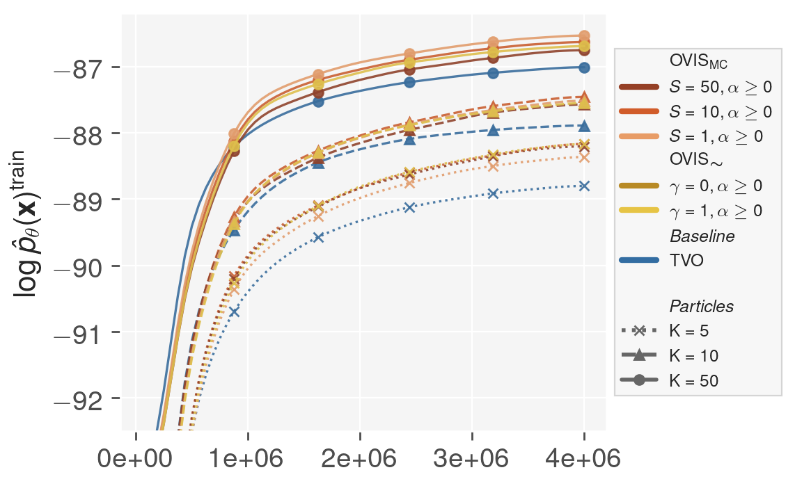
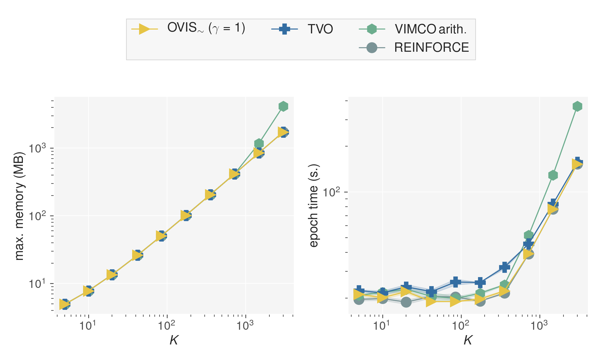

Code for the *Optimal Variance Control of the Score Function Gradient Estimator for Importance Weighted Bounds* (a.k.a **OVIS** : Optimal Variance -- Importance Sampling).

**[Warning]** Refactoring in progress, minor adjustments are being made.

## Abstract 

> This paper introduces novel results for the score function gradient estimator of the importance weighted variational bound (IWAE). We prove that in the limit of large $K$ (number of importance samples) one can choose the control variate such that the Signal-to-Noise ratio (SNR) of the estimator grows as $\sqrt{K}$. This is in contrast to the standard pathwise gradient estimator where the SNR decreases as $1/\sqrt{K}$. Based on our theoretical findings we develop a novel control variate that extends on VIMCO. Empirically, for the training of both continuous and discrete generative models, the proposed method yields superior variance reduction, resulting in an SNR for IWAE that increases with $K$ without relying on the reparameterization trick. The novel estimator is competitive with state-of-the-art reparameterization-free gradient estimators such as Reweighted Wake-Sleep (RWS) and the thermodynamic variational objective (TVO) when training generative models.

## Requirements

```bash
conda create -n ovis python=3.7
conda activate ovis
# use the instructions from https://pytorch.org/
conda install pytorch=1.5.1 torchvision cudatoolkit=10.2 -c pytorch 
pip install -r requirements.txt
```

## Experiments

All experiments are managed through the script `manager.py` which implement a mutli-threaded queue system based on
`TinyDB` and a `filelock` protection. See `python manager.py --help` for more information about the number of 
subprocesses and resuming experiments. The scripts `dbutils.py` provides a few utilities to inspect and clean 
the experiment database.  `report.py` allows parsing an experiment directory and producing figures.

### Asymptotic Variance




Anaysis of the gradients for a simple Gaussian model. Figure 1:

```bash
# run the experiment
python manager.py --exp asymptotic-analysis
# produce the figures
python report_asymptotic_variance --exp asymptotic-analysis
# access the results
open reports/asymptotic-variance
```

### Gaussian Mixture Model



Train a simple Gaussian Mixture model. Figure 2:

```bash
# run the experiment
python manager.py --exp gaussian-mixture-model
# produce the figures
python report.py --exp=gaussian-mixture-model \
    --keys=dataset,estimator,iw \
    --metrics=test:gmm/posterior_mse,test:gmm/prior_mse,train:grads/variance,train:grads/snr \
    --detailed_metrics=test:gmm/posterior_mse,test:gmm/prior_mse,train:loss/ess,train:grads/variance,train:grads/snr \
    --pivot_metrics=min:test:gmm/posterior_mse,min:test:gmm/prior_mse,mean:train:grads/snr 
# access the results
open reports/gaussian-mixture-model
```

### Sigmoid Belief Network

Train a 3-layers Sigmoid Belief Network using the Importance-Weighted Bound (IW) and the Rényi Importance Weighted Bound (IWR).
Run all experiments:

```bash
# run the experiment
python manager.py --exp sigmoid-belief-network
```


Figure 3 (left, VIMCO + OVIS-IW):

```bash
# gather the data
python report.py --exp=sigmoid-belief-network  \
    --include=iwbound \
    --keys=dataset,estimator,iw  \
    --metrics=test:loss/L_k,train:loss/L_k,train:loss/kl_q_p,train:grads/snr \
    --detailed_metrics=test:loss/L_k,train:loss/L_k,train:loss/kl_q_p,train:loss/kl,train:loss/ess,train:active_units/au,train:grads/snr \
    --pivot_metrics=max:test:loss/L_k,max:train:loss/L_k,last:test:loss/kl_q_p,last:train:loss/ess \
    --ylims=test:loss/L_k:-94:-88,train:loss/L_k:-93:-86
# produce the figure
python report_figure3.py --figure left
# access the results
open reports/sigmoid-belief-network-inc=iwbound
```

Figure 3 (right, TVO + OVIS-IWR):



```bash
# gather the data
python report.py --exp=sigmoid-belief-network  \
    --include=iwrbound,tvo \
    --keys=dataset,estimator,iw  \
    --metrics=test:loss/L_k,train:loss/L_k,train:loss/kl_q_p,train:grads/snr \
    --detailed_metrics=test:loss/L_k,train:loss/L_k,train:loss/kl_q_p,train:loss/kl,train:loss/ess,train:active_units/au,train:grads/snr \
    --pivot_metrics=max:test:loss/L_k,max:train:loss/L_k,last:test:loss/kl_q_p,last:train:loss/ess \
    --ylims=test:loss/L_k:-94:-88,train:loss/L_k:-93:-86
# produce the figure
python report_figure3.py --figure right
# access the results
open reports/sigmoid-belief-network-inc=iwrbound
```

### Gaussian VAE


Train a 1-layer Gaussian VAE. Figure 4:

```bash
# produce the figures
python report.py --exp=gaussian-vae  \
    --keys=dataset,estimator,iw  \
    --metrics=test:loss/L_k,train:loss/L_k,train:loss/kl_q_p,train:grads/snr \
    --detailed_metrics=train:loss/L_k,train:loss/kl_q_p \
    --pivot_metrics=max:train:loss/L_k,last:train:loss/kl_q_p,mean:train:loss/ess
# access the results
open reports/gaussian-vae
```

### Computational Efficiency



Measure the memory usage and running time

```bash
# produce the figures
python measure_efficiency.py
```

## Using and Extending OVIS

```bash
# install the latest release
pip install git+https://github.com/vlievin/ovis.git
# OR install in dev. mode
git clone https://github.com/vlievin/ovis.git && pip install -e ovis/
```

The full example is available in `example.py`. 

#### Initialize a gradient estimator

```python
from ovis.estimators.config import get_config
Estimator, config = get_config("ovis-gamma1")
estimator = Estimator(mc=1, iw=16, **config)
```

#### Train your model and analyse the gradients

```python
from ovis.analysis.gradients import get_gradients_statistics
from booster import Aggregator
agg = Aggregator()
for x in loader:
    global_step += 1
    loss, diagnostics, output = estimator(model, x, backward=False, **config)
    loss.mean().backward()
    optimizer.step()
    optimizer.zero_grad()
    agg.update(diagnostics)
    # update parameters
    update_fn(config)
    
# epoch summary
summary = agg.data.to('cpu')

# analyse the gradients of the parameters of the inference network
grad_stats, _ = get_gradients_statistics(estimator, model, x, mc_samples=10, key_filter='inference_network')
summary.update(grad_stats)

# log data
summary.log(tensorboard_writer, global_step)
```

#### Implemet your own `nn.Module` following the `Template` class (`ovis/models/template.py`):

```python
from torch import nn, Tensor, zeros
from torch.distributions import Bernoulli
from ovis.models import Template

class SimpleModel(Template):
    def __init__(self, xdim, zdim):
        super().__init__()
        self.inference_network = nn.Linear(xdim, zdim)
        self.generative_model = nn.Linear(zdim, xdim)
        self.register_buffer('prior', zeros((1, zdim,)))

    def forward(self, x:Tensor, zgrads:bool=False, **kwargs):
        # q(z|x)
        qz = Bernoulli(logits=self.inference_network(x))
        # z ~ q(z | x)
        z = qz.rsample() if zgrads else qz.sample()
        # p(x)
        pz = Bernoulli(logits=self.prior)
        # p(x|z)
        px = Bernoulli(logits=self.generative_model(z))
        # store z, pz, qz as list for hierarchical models
        return {'px': px, 'z': [z], 'qz': [qz], 'pz': [pz]}

    def sample_from_prior(self, bs: int, **kwargs):
        pz = Bernoulli(logits=self.prior.expand(bs, *self.prior.shape[1:]))
        z = pz.sample()
        px = Bernoulli(logits=self.generative_model(z))
        return {'px': px, 'z': [z], 'pz': [pz]}

# generate x ~ Bernoulli(0.5) and compute a forward pass 
x = Bernoulli(logits=zeros((1, 10,))).sample()
model = SimpleModel(10, 10)
output = model(x)
output = model.sample_from_prior(1)
```

### Available Gradient Estimators

* Reparameterization-free:
    * Reinforce
    * Reinforce + Neural Baseline
    * Vimco
    * Reweighted Wake-Sleep
    * TVO
    * OVIS

* Reparameterization-based:
    * VAE
    * IWAE