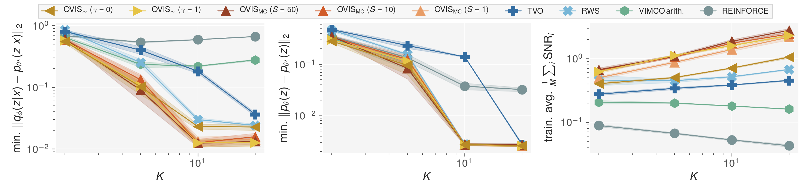
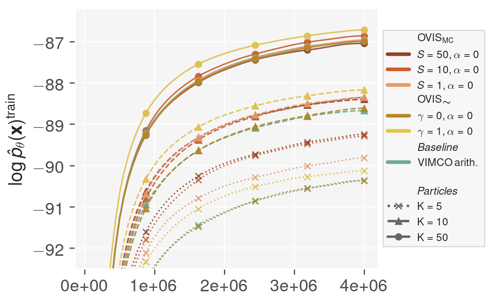
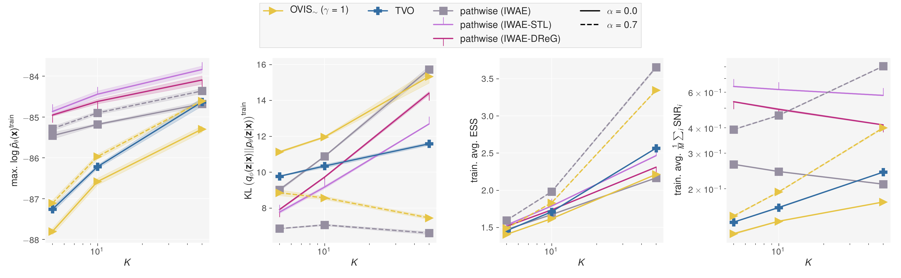
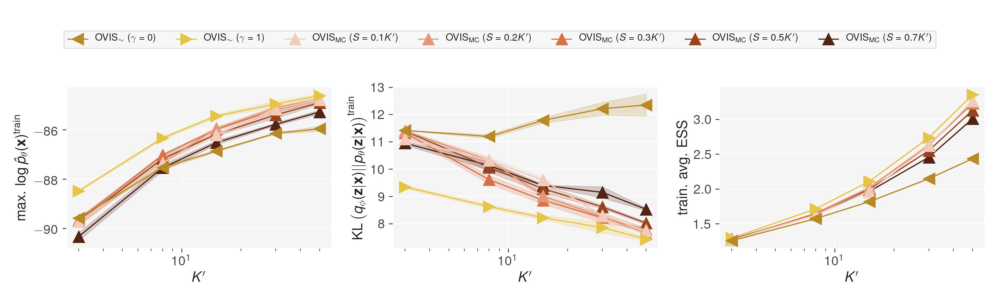
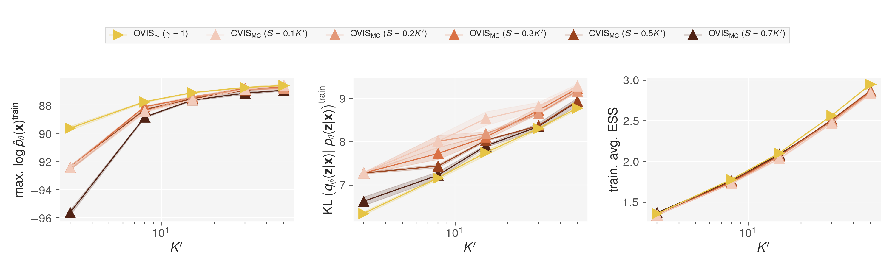

Official code for the *Optimal Variance Control of the Score Function Gradient Estimator for Importance Weighted Bounds* (a.k.a **OVIS** : Optimal Variance -- Importance Sampling). Published at NeuriPS 2020.

- [NeurIPS 2020 proceedings](https://proceedings.neurips.cc/paper/2020/hash/c15203a83f778ce8934d0efaf2d5c6f3-Abstract.html)
- [Arxiv preprint](https://arxiv.org/abs/2008.01998)

OVIS is a state-of-the-art gradient estimator for discrete VAEs. This repo provides a user-friendly interface to OVIS, and other gradient estimators. OVIS can easily be imported in your project to train and evaluate discrete VAEs. The implementation is compatible with a wide variety of VAE models, including hierarchical ones. This library allows reproducing all the experiments from the paper.

## Citation

```
@inproceedings{NEURIPS2020_c15203a8,
 author = {Li\'{e}vin, Valentin and Dittadi, Andrea and Christensen, Anders and Winther, Ole},
 booktitle = {Advances in Neural Information Processing Systems},
 editor = {H. Larochelle and M. Ranzato and R. Hadsell and M. F. Balcan and H. Lin},
 pages = {16591--16602},
 publisher = {Curran Associates, Inc.},
 title = {Optimal Variance Control of the Score-Function Gradient Estimator for Importance-Weighted Bounds},
 url = {https://proceedings.neurips.cc/paper/2020/file/c15203a83f778ce8934d0efaf2d5c6f3-Paper.pdf},
 volume = {33},
 year = {2020}
}

```

## Included in this library

* Reparameterization-free:
    * Reinforce
    * Reinforce + Neural Baseline
    * [Vimco](https://arxiv.org/abs/1602.06725)
    * [RWS (Reweighted Wake-Sleep)](https://arxiv.org/abs/1805.10469)
    * [TVO (Thermodynamic Variational Objective)](https://arxiv.org/abs/1907.00031)
    * [OVIS](https://arxiv.org/abs/2008.0199)

* Reparameterization-based:
    * VAE
    * [IWAE](https://arxiv.org/abs/1509.00519)
    * [IWAE-STL (Sticking the Landing)](https://arxiv.org/abs/1703.09194)
    * [IWAE-DReG (Doubly Reparameterized Gradient Estimators for Monte Carlo Objectives)](https://arxiv.org/abs/1810.04152)


## Train your own models using OVIS

OVIS can easily be imported in your own project to train your own discrete VAE/generative models. You simply need to define your model following the example bellow. The full example is available in `example.py`. 

#### 0. installing as a package

```bash
# install the latest release
pip install git+https://github.com/vlievin/ovis.git
# OR install in dev. mode
git clone https://github.com/vlievin/ovis.git && pip install -e ovis/
```

#### 1. Initialize a gradient estimator

Gradient estimators can be initialized in 2 lines. Using the estimator, computing the loss for your model is a one liner.

```python
# init the estimator
from ovis.estimators.config import parse_estimator_id
Estimator, config = parse_estimator_id("ovis-gamma1")
estimator = Estimator(mc=1, iw=16, **config)

# use it to compute the differentiable loss
loss, diagnostics, output = estimator(model, x)
```

#### 2. Implement your own `nn.Module` following the `TemplateModel` class (`ovis/models/template.py`):

OVIS relies on `torch.distributions` to implement the variational distributions. The library has been tested with normal, bernoulli and categorical distributions, but this should work with other distributions as well as long as it comes with a `.log_prob()` method. 

Every model should implement:
* `forward(self, x:Tensor, reparam:bool=False, **kwargs) -> OUTPUT` 
* `sample_from_prior(self, bs: int, **kwargs)-> OUTPUT`

Where the output format is defined as `OUTPUT=Dict[str, Union[Distribution, List[Tensor], List[Distribution]]]`.

The output is a dictionary with keys:
* `px`: `Distribution` : distribution modelling `p(x|z)`
* `z`: `List[Tensor]` : latent samples `z`, one item for each layer
* `pz`: `List[Distribution]` : prior distribution `p(z)`, one item for each layer
* `qz`: `List[Distribution]` : posterior distribution `q(z|x)`, one item for each layer


```python
from torch import nn, Tensor, zeros
from torch.distributions import Bernoulli
from ovis.models import TemplateModel

class SimpleModel(TemplateModel):
    def __init__(self, xdim, zdim):
        super().__init__()
        self.inference_network = nn.Linear(xdim, zdim)
        self.generative_model = nn.Linear(zdim, xdim)
        self.register_buffer('prior', zeros((1, zdim,)))

    def forward(self, x:Tensor, reparam:bool=False, **kwargs):
        # q(z|x)
        qz = Bernoulli(logits=self.inference_network(x))
        # z ~ q(z|x)
        z = qz.rsample() if reparam else qz.sample()
        # p(x)
        pz = Bernoulli(logits=self.prior)
        # p(x|z)
        px = Bernoulli(logits=self.generative_model(z))
        # store z, pz, qz as lists (useful for hierarchical models)
        return {'px': px, 'z': [z], 'qz': [qz], 'pz': [pz]}

    def sample_from_prior(self, bs: int, **kwargs):
        pz = Bernoulli(logits=self.prior.expand(bs, *self.prior.shape[1:]))
        z = pz.sample()
        px = Bernoulli(logits=self.generative_model(z))
        return {'px': px, 'z': [z], 'pz': [pz]}

# generate x ~ Bernoulli(0.5), initialize a simple VAE, forward pass, prior sampling
x = Bernoulli(logits=zeros((1, 10,))).sample()
model = SimpleModel(10, 10)
output = model(x)
output = model.sample_from_prior(1)
```

#### 3. Train your model and analyse the gradients

The code bellow shows a simple training loop for training a model.
Notice how `parameters` can be used for various types of scheduling (i.e. $\beta$-annealing).
The estimator also returns useful information regarding the computation of the gradients, such as the ELBO, KL or the effective sample size (ESS).

```python
from ovis.analysis.gradients import get_gradients_statistics
from booster import Aggregator
agg = Aggregator()
parameters = {'alpha': 0.9, 'beta': 1}
for x in loader:
    global_step += 1
    loss, diagnostics, output = estimator(model, x, backward=False, **parameters)
    loss.mean().backward()
    optimizer.step()
    optimizer.zero_grad()
    agg.update(diagnostics)
    # update parameters
    update_fn(parameters)
    
# epoch summary
summary = agg.data.to('cpu')

# analyse the gradients of the parameters of the inference network
grad_stats, _ = get_gradients_statistics(estimator, model, x, mc_samples=10, key_filter='inference_network')
summary.update(grad_stats)

# log data
summary.log(tensorboard_writer, global_step)
```

## Requirements

```bash
conda create -n ovis python=3.7
conda activate ovis
# use the instructions from https://pytorch.org/
conda install pytorch=1.5.1 torchvision cudatoolkit=10.2 -c pytorch 
pip install -r requirements.txt
# [Optional] Install Latex (used for the figures)
```

## Abstract 

This paper introduces novel results for the score function gradient estimator of the importance weighted variational bound (IWAE). We prove that in the limit of large $K$ (number of importance samples) one can choose the control variate such that the Signal-to-Noise ratio (SNR) of the estimator grows as $\sqrt{K}$. This is in contrast to the standard pathwise gradient estimator where the SNR decreases as $1/\sqrt{K}$. Based on our theoretical findings we develop a novel control variate that extends on VIMCO. Empirically, for the training of both continuous and discrete generative models, the proposed method yields superior variance reduction, resulting in an SNR for IWAE that increases with $K$ without relying on the reparameterization trick. The novel estimator is competitive with state-of-the-art reparameterization-free gradient estimators such as Reweighted Wake-Sleep (RWS) and the thermodynamic variational objective (TVO) when training generative models.

## Reproducing the experiments

All experiments are managed through the script `manager.py` which implement a mutli-threaded queue system based on
`TinyDB` and a `filelock` protection. See `python manager.py --help` for more information about the number of 
subprocesses and resuming experiments. The scripts `dbutils.py` provides a few utilities to inspect and clean 
the experiment database.  `report.py` allows parsing an experiment directory and producing figures. Usage:

```bash
# begins an experiment with 2 processes per GPU (max. 2 GPUs)
python manager.py --exp exp_id --processes n_procs_per_gpu --max_gpus 2
# show the experiment status [queued, aborted, failed, running, success] 
python dbutils.py --exp exp_id --check
# requeue aborted experiments
python dbutils.py --exp exp_id --requeue --requeue_level 1
# generate plots
python report.py --exp exp_id --metrics train:loss/L_k,train:grads/snr --pivot_metrics train:loss/L_k,train:grads/snr 
```

### Asymptotic Variance


Anaysis of the gradients for a simple Gaussian model. Figure 1:

```bash
# run the experiment
python manager.py --exp asymptotic-variance
# produce the figures
python report_asymptotic_variance --exp asymptotic-variance
# access the results
open reports/asymptotic-variance
```

### Gaussian Mixture Model



Train a simple Gaussian Mixture model. Figure 2:

```bash
# run the experiment
python manager.py --exp gaussian-mixture-model
# produce the figures
python report.py --exp=gaussian-mixture-model \
    --keys=dataset,estimator,iw \
    --metrics=test:gmm/posterior_mse,test:gmm/prior_mse,train:grads/variance,train:grads/snr \
    --detailed_metrics=test:gmm/posterior_mse,test:gmm/prior_mse,train:loss/ess,train:grads/variance,train:grads/snr \
    --pivot_metrics=min:test:gmm/posterior_mse,min:test:gmm/prior_mse,mean:train:grads/snr \
    --ylims=train:loss/ess:0:21
# access the results
open reports/gaussian-mixture-model
```

### Sigmoid Belief Network

Train a 3-layers Sigmoid Belief Network using the Importance-Weighted Bound (IW) and the Rényi Importance Weighted Bound (IWR).
Run all experiments:

```bash
# run the experiment
python manager.py --exp sigmoid-belief-network
```

Figure 3 (left, VIMCO + OVIS-IW), 3 seeds:

 

```bash
# gather the data
python report.py --exp=sigmoid-belief-network  \
    --include=iwbound \
    --keys=dataset,estimator,iw  \
    --metrics=test:loss/L_k,train:loss/L_k,train:loss/kl_q_p,train:grads/snr \
    --detailed_metrics=test:loss/L_k,train:loss/L_k,train:loss/kl_q_p,train:loss/kl,train:loss/ess,train:active_units/au,train:grads/snr \
    --pivot_metrics=max:test:loss/L_k,max:train:loss/L_k,last:train:loss/kl_q_p,last:train:loss/ess \
    --ylims=test:loss/L_k:-94:-88,train:loss/L_k:-93:-86
# produce the figure
python report_figure3.py --figure left
# access the results
open reports/sigmoid-belief-network-inc=iwbound
```

Figure 3 (right, TVO + OVIS-IWR), 3 seeds:


```bash
# gather the data
python report.py --exp=sigmoid-belief-network  \
    --include=iwrbound \
    --keys=dataset,estimator,iw  \
    --metrics=test:loss/L_k,train:loss/L_k,train:loss/kl_q_p,train:grads/snr \
    --detailed_metrics=test:loss/L_k,train:loss/L_k,train:loss/kl_q_p,train:loss/kl,train:loss/ess,train:active_units/au,train:grads/snr \
    --pivot_metrics=max:test:loss/L_k,max:train:loss/L_k,last:train:loss/kl_q_p,last:train:loss/ess \
    --ylims=test:loss/L_k:-94:-88,train:loss/L_k:-93:-86
# produce the figure
python report_figure3.py --figure right
# access the results
open reports/sigmoid-belief-network-inc=iwrbound
```

### Gaussian VAE



Train a 1-layer Gaussian VAE. Figure 4:

```bash
# produce the figures
python report.py --exp=gaussian-vae  \
    --keys=dataset,estimator,iw  \
    --metrics=test:loss/L_k,train:loss/L_k,train:loss/kl_q_p,train:grads/snr \
    --detailed_metrics=train:loss/L_k,train:loss/kl_q_p,train:grads/snr  \
    --pivot_metrics=max:train:loss/L_k,last:train:loss/kl_q_p,mean:train:loss/ess
# access the results
open reports/gaussian-vae
``` 
    
## Additional Results

### Binarized MNIST, Fashion MNIST and Omniglot

Fitting the Binarized MNIST, Fashion MNIST and Omniglot datasets. The hyperparameters are identical for all experiments.
With and Without Rényi warmup.

#### Sigmoid Belief Network

```bash
python report.py --exp=sigmoid-belief-network  \
   --keys=dataset,estimator,iw,warmup  \
   --metrics=test:loss/L_k,train:loss/L_k,train:loss/kl_q_p,train:grads/snr  \
   --detailed_metrics=test:loss/L_k,train:loss/L_k,train:loss/kl_q_p,train:loss/kl,train:loss/ess,train:active_units/au,train:grads/snr  \
   --pivot_metrics=max:test:loss/L_k,max:train:loss/L_k,last:train:loss/kl_q_p,last:train:loss/ess,last:train:active_units/au \
   --downsample 50 \
   --include tvo,vimco,ovis-gamma1
```


#### Gaussian VAE

```bash
python report.py --exp=gaussian-vae \
   --keys=dataset,estimator,iw,alpha  \
   --metrics=test:loss/L_k,train:loss/L_k,train:loss/kl_q_p,train:grads/snr  \
   --detailed_metrics=test:loss/L_k,train:loss/L_k,train:loss/kl_q_p,train:loss/kl,train:loss/ess,train:active_units/au,train:grads/snr  \
   --pivot_metrics=max:test:loss/L_k,max:train:loss/L_k,last:train:loss/kl_q_p,last:train:loss/ess,last:train:grads/snr \
   --downsample 50 
```


### Budget Analysis

In this experiment, we compare the asymptotic OVIS (gamma=1) with the sample based control OVIS-MC. By contrast with 
the previous experiments, the total particle budget remains equals to `K`. 
The `K` particles are used to estimate the gradient of the generative model, 
`K-S` particles are used to evaluate the score based estimate of the gradient of the inference network and `S` particles 
are used to estimate the control variate. In the following plots, the identifier `ovis-Sy` indicates that `S = yK`. 
See experiment `.json` file for more details.

#### Gaussian VAE

```bash
# run the experiment
python manager.py --exp budget-analysis
# produce the figures
python report.py --exp=budget-analysis  \
    --keys=dataset,estimator,iw \
    --metrics=test:loss/L_k,train:loss/L_k,train:loss/kl_q_p,train:grads/snr  \
    --detailed_metrics=train:loss/L_k,train:loss/kl_q_p  \
    --pivot_metrics=max:train:loss/L_k,last:train:loss/kl_q_p,mean:train:loss/ess
# access the results
open reports/budget-analysis
```



#### Sigmoid Belief Network

```bash
# run the experiment
python manager.py --exp budget-analysis-sbm
# produce the figures
python report.py --exp=budget-analysis-sbm  \
    --keys=dataset,estimator,iw \
    --metrics=test:loss/L_k,train:loss/L_k,train:loss/kl_q_p,train:grads/snr  \
    --detailed_metrics=train:loss/L_k,train:loss/kl_q_p  \
    --pivot_metrics=max:train:loss/L_k,last:train:loss/kl_q_p,mean:train:loss/ess
# access the results
open reports/budget-analysis-sbm
```




### Computational Efficiency

Checking the memory usage of the different estimators given different particles budgets.

```bash
python measure_efficiency.py
```


